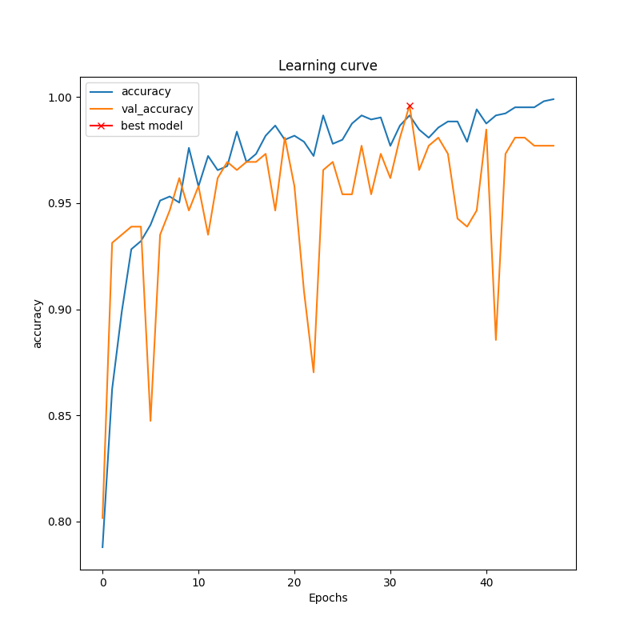
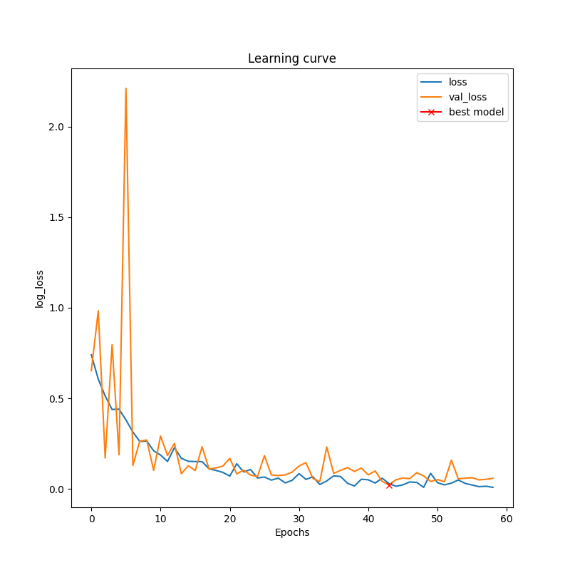

# ZindiWeekends_SpotTheMaskChallenge

<p align="center">Note: If you're interested in using it, feel free to ⭐️ the repo so we know!</p>

## Dataset

The data have been split into a test and training set. The training set contains ~1300 images and the test set contains 509 images. There are two types of images in this dataset, people or images with face masks and people or images without.

Your task is to provide the probability that an image contains at least one mask. For each unique image ID you should estimate the likelihood that the image contains at least one mask, with an estimated probability value between 0 and 1.

The dataset comprises of the following files:

- [images.zip (~193mb)](https://api.zindi.africa/v1/competitions/spot-the-mask-challenge/files/images.zip)
- [train_labels.csv](https://api.zindi.africa/v1/competitions/spot-the-mask-challenge/files/train_labels.csv)
- [sample_submission.csv](https://api.zindi.africa/v1/competitions/spot-the-mask-challenge/files/sample_sub_v2.csv)

Details about the dataset and challenge can be seen on [Challenge page](https://zindi.africa/hackathons/spot-the-mask-challenge)

## Data Prepration
Images in the dataset did not have fixed size therfore it was mandatory to resize them for training. Therefore after careful consideration and looking at memory constraints we decided to resize all the images to 256x256. Along with this Images were normalized before performing data augmentation.

The size of dataset is small so we needed to add more data for training and we used data augmentations. For Data Augmentation we performed:

- Rotation
- Zoom
- Shear 
- Width Shift
- Heights Shift

## Model Diagram
For this Challenge we have used EfficientNet-B0 as it was lightweights as compared to its counterparts.

The architecture of EfficientNet-B0 is as follows: 


Comparision of EfficientNet-B0 with other models with respect to Top1 Accuracy and Parameters
<p align="center"></p>

We had also tried other models but didn't perform better than EfficientNet-B0. Some of these models were:
- Inception-ResNet V2
- Xception
- VGG16
- Inception V3

## Pre-Trained Models
The Pre-Trained models can be downloaded from [google drive](https://drive.google.com/drive/folders/1g5SdbW8q1Z0e9dk6cW431JO01BDq4g0H).

## Installation
To get this repo work please install all the dependencies using the command below:
```
pip install -r requirments.txt
```

## Training
To start training run the Train.py script from the command below. For training configurations refer to the [config.json](./config.json) file. You can update the file according to your training settings. Model avaible for training is EfficientNet-B0.
```
 python Train.py
```

## Testing
To test the trained models on Test Images you first have to download the weights. After downliading the weights you unzip them and then run the Inference by using the command below. For testing configurations please refer to the [config.json](./config.json) file.
```
python Test.py
```
## Quantitatvie Results
Results on Private Leaderboard of Challenge

| Model | Loss | Accuracy | 
| ----- | ---- | ---- | 
| EfficientNet-B0 | 0.0256 | 0.9920 

## Results
EfficientNet-B0 is trained for this task and the model is evaluated on accurary and loss function used is Binary Cross Entropy.
<p float="center">
	
  	
</p>

## Author
`Maintainer` [Syed Nauyan Rashid](https://https://github.com/nauyan) (nauyan@hotmail.com)

## Acknowledgements
- [Implementation of EfficientNet by qubvel](https://github.com/qubvel/efficientnet)
